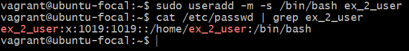
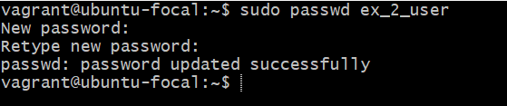
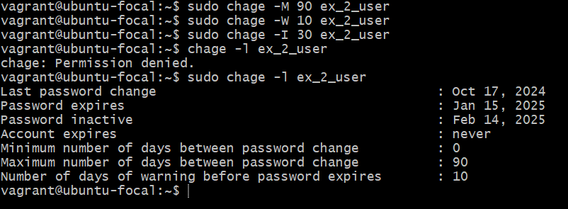
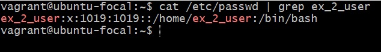
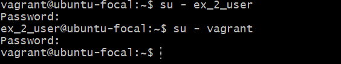
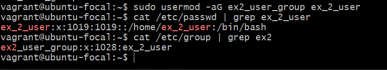
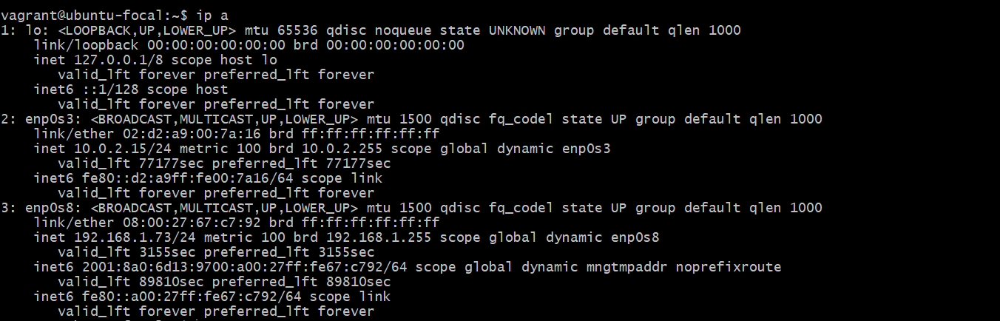

es# Question Exercise 2

Task: Research online for 10 more linux commands aside the ones already mentioned in this module.
Submit using your altschool-cloud-exercises project, explaining what each command is used for with examples of how to use each and example screenshots of using each of them.

Instruction: Submit your work in a folder for this exercise in your altschool-cloud-exercises project. You will need to learn how to embed images in markdown files.

# 1. Create User:

The useradd command is used to create a new user. The -m flag creates a home directory for the new user, and the -s option specifies the login shell (in this case, /bin/bash).
```
sudo useradd -m -s /bin/bash newuser
```


# 2. Set Password:
The passwd command is used to set or change the password for a user.
```
sudo passwd newuser
```



# 3. Establishing user password policies
The chage command helps enforce user password policies:

Set Expiry (-M): Define maximum days until password expires.
Warning (-W): Set warning days before expiry.
Inactive (-I): Disable account if password isn’t updated after expiry.
Info (-l): View password aging details for a user.
These options enhance password security and enforce timely updates

```
/etc/passwd
```



# 4. Check specific User:
```grep```  searches for the user in the /etc/passwd file to check if the user exists or to retrieve specific user information.
```
cat /etc/passwd | grep newuser
```


# 5. Switch User:
 The ```su``` command allows you to switch to another user. The - option provides a login shell with the user's environment.

```
su - newuser
```


# 6. Create Group:
```groupadd``` creates a new group that users can be added to.
```
sudo groupadd newgroup
```


# 7. Add User to Group:
```
sudo usermod -aG newgroup newuser
```



### Explanation
This user modification (usermod) helps to add user to a group,  using - ``` -aG ``` parameters where
```

  -G, --groups GROUPS           new list of supplementary GROUPS
  -a, --append                  append the user to the supplemental GROUPS
                                mentioned by the -G option without removing
                                the user from other groups

```
The output note in this explanation was generated by running the help command ``` usermod --help```


# 8.  Testing connectivity between devices. 
 It sends ICMP (Internet Control Message Protocol) echo requests to a specified IP address or hostname and waits for a response. 
The command helps measure round-trip time, detect packet loss, and determine whether a remote device is reachable.

 ```
ping github.com
```


# 9.  Check Network Configuration:
The ip a command is a shorthand for ip address and is used to display detailed information about all network interfaces on a Linux system. It shows information such as:

IP Addresses (both IPv4 and IPv6)
Interface Names (e.g., eth0, wlan0, lo)
MAC Addresses (hardware addresses)
Network Status (whether the interface is up or down)
Broadcast and Multicast addresses
This command provides a more detailed and modern replacement for ifconfig to view network interface configurations.
```
ip a
```


# 10. Modify user permissions on a file

```
chmod 755 filename
```
7 = 4+2+1 where 4 is read, 2 is write
1 is execute in that order. 755 here means userpermission group permission others permissions (in that order). 7=4+2+1 for user so read(4), write(2) and execute(1), group =5 (read 4, execute 1)
